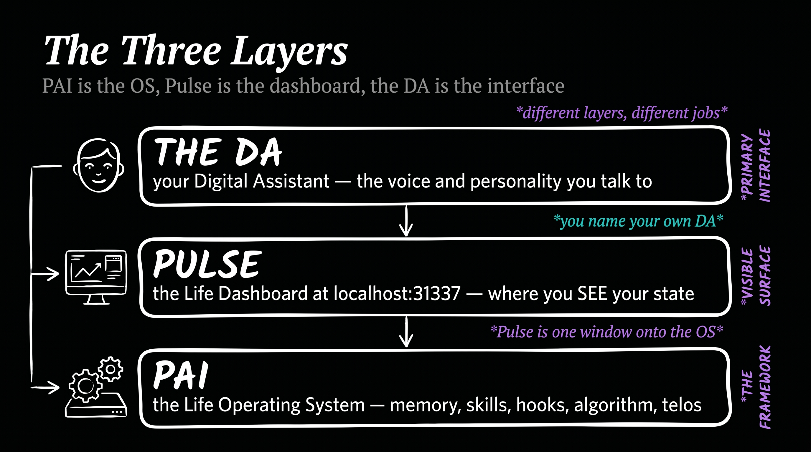
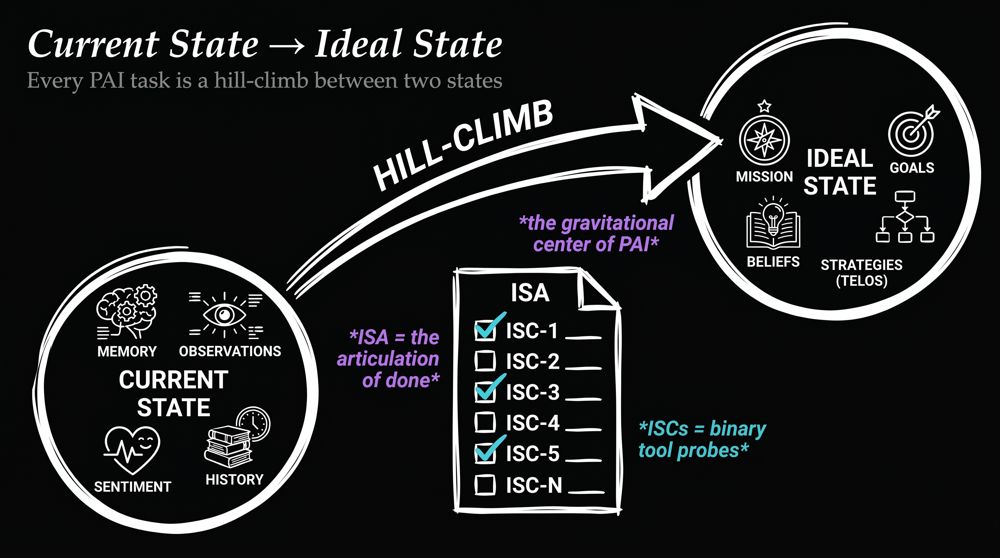
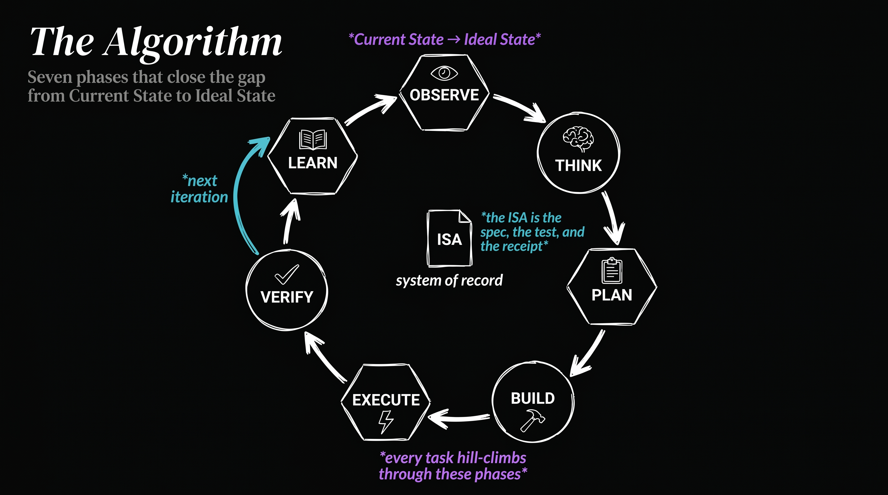

<div align="center">

<picture>
  <source media="(prefers-color-scheme: dark)" srcset="./images/pai-logo-v7.png">
  <source media="(prefers-color-scheme: light)" srcset="./images/pai-logo-v7.png">
  
</picture>

<br/>
<br/>

# Personal AI Infrastructure

[](https://github.com/danielmiessler/Personal_AI_Infrastructure)

<br/>

<!-- Social Proof -->


<!-- Project Health -->


<!-- Metrics -->


<!-- Content -->
[](#-installation)
[](Releases/)
[](Releases/v5.0.0/.claude/PAI/ALGORITHM/v6.3.0.md)
[](Releases/v5.0.0/.claude/PAI/PULSE/)
[](https://github.com/danielmiessler/Personal_AI_Infrastructure/graphs/contributors)

<!-- Tech Stack -->
[](https://claude.ai)
[](https://www.typescriptlang.org/)
[](https://bun.sh)
[](https://danielmiessler.com/upgrade)

<br/>

**Overview:** [What PAI Is](#what-pai-is) · [Principles](#principles) · [Features](#features)

**Get Started:** [Installation](#-installation) · [Releases](Releases/) · [Packs](Packs/)

**Resources:** [FAQ](#-faq) · [Roadmap](#-roadmap) · [Community](#-community) · [Contributing](#-contributing)

<br/>

**[Watch the PAI walkthrough →](https://youtu.be/Le0DLrn7ta0)** · **[Read: The Real Internet of Things](https://danielmiessler.com/blog/the-real-internet-of-things)**

---

</div>

> [!IMPORTANT]
> **v5.1.0 — Life Operating System** (Linux compat + installer polish on the v5.0.0 base). Install: `curl -sSL https://ourpai.ai/install.sh | bash` · **[v5.0.0 release notes](Releases/v5.0.0/README.md)** · Upgrading from v4.x → read the [migration guide](Releases/v5.0.0/README.md#migration-guide-from-v4x) first (different system, not a patch).

<div align="center">

# AI should magnify everyone—not just the top 1%.

</div>

## What PAI Is

PAI started in June of 2025 to answer a single question:

> What are we building with all this AI?

It's great that we have all these prompts, and models, and agents, and harnesses — but what are we actually *doing* with them?

PAI is the answer to that question. It's an AI system built around people, designed to magnify human capabilities and help you pursue your **ideal state**. It still does all the regular things an AI harness does — code, build, research, automate — but it does them better because it deeply understands the larger picture of what you're trying to accomplish.

**PAI is the Life Operating System.** Like a computer operating system, it manages the resources, processes, identity, memory, and interfaces that let a person live and work. The difference is that the resources it manages are *your life* — your goals, your relationships, your work, your health, your creative output, your time. PAI is not a chatbot. PAI is not a dashboard. PAI is not a passive "AI scaffolding framework." PAI is the OS underneath all of that.

Three layers sit on top of each other, each with a distinct job:



- **PAI** — the **Life Operating System** itself. Skills, memory, hooks, the Algorithm, your Telos, your identity files. Everything the DA runs on top of.
- **Pulse** — the **Life Dashboard** at `localhost:31337`. The visible surface onto the OS, where you (and the DA, and every background worker) see current state vs. ideal state, goals, workflows, observability.
- **The DA** — your **Digital Assistant**. The voice and personality you actually talk to. Everyone running PAI names their own DA.

PAI targets **AS3** on the [PAI Maturity Model](https://danielmiessler.com/blog/personal-ai-maturity-model), with lineage from [The Real Internet of Things](https://danielmiessler.com/blog/the-real-internet-of-things) (2016).

---

## Principles

### Humans first, tech second

PAI puts the human at the center, not the tooling. Tech is here to improve the lives of people, not the other way around. Every design decision starts from one question: what does this do for the person running it?

### A Life OS, not an agent harness

PAI builds a personal Life OS using **TELOS** — your mission, goals, beliefs, wisdom, strategies, narratives, challenges, and mental models — to help you capture, articulate, and pursue your life and work goals. PAI absolutely *can* still build, code, and run agents, but those capabilities exist in service of the larger goal: helping you pursue your ideal state across your entire life and work, not just the next coding task.

### Ideal State drives everything

The biggest unsolved problem with AI is the inability to define what "good" or "done" actually looks like. PAI is built around **Ideal State** — specifically the transition between your current state and your ideal state — and that concept is woven through every layer.



The primary expression is the **ISA** (Ideal State Artifact). An ISA is similar to a software PRD — it captures what done looks like so you can work toward it. The difference is that an ISA is *general* — it works for any creative task, from design to art to philosophy to engineering to strategy. The system creates discrete **ISCs** (Ideal State Criteria) that make up the body of the ISA document and *also* serve as the verification items. That's how PAI hill-climbs toward ideal state on any kind of work.

### A single Digital Assistant will be everyone's interface to AI

The trajectory is clear: chatbots → agents → assistants. We're all building the same thing, and the endpoint is one DA per person. I wrote about this in 2016 in [**The Real Internet of Things**](https://danielmiessler.com/blog/the-real-internet-of-things) (TRIOT), and I'm more convinced now than I was then.

TRIOT had four core ideas that PAI is built on:

- **Digital Assistants** — one DA per person, your primary interface to all AI
- **Everything gets an API** — every product, service, person, and place becomes addressable
- **Your DA dynamically creates your interfaces** — no more static apps and dashboards; the DA assembles whatever you need in the moment
- **You define your ideal state, AI helps you get there** — the whole system points at your Telos

PAI is the infrastructure that makes that future buildable.

---

## Features

### Heavy bias toward text

PAI tries to avoid opaque storage structures wherever possible — SQLite, Postgres, embedding stores — because we want everything to be as transparent and parsable as possible. Plain text and Markdown by default. Your filesystem is the index. If `cat`, `rg`, and your eyes can't read it, PAI doesn't want it.

### Context Scaffolding > Model

The mistake most people make with AI is not properly feeding it the big picture via context engineering. PAI is fundamentally a system for providing the smartest models with the right context — about you, about what you're trying to accomplish — along with the best possible tooling, so they can actually help you move toward ideal state. The model matters less than what surrounds it.

### Bitter-pilled engineering

Although we believe strongly in the context scaffold (above), we believe equally strongly that as models get stronger, we will have to give them *fewer* instructions on how to specifically accomplish tasks. PAI is constantly adjusted to remove overly prescriptive direction wherever the model can do better given the right context and tools. The system gets smaller as the models get bigger.

### Filesystem as context (no RAG)

PAI has avoided RAG since its start in June 2025. Rich text content with cross-references, combined with fast search like ripgrep, gives us everything people usually want from a RAG system — without the complexity, embedding cost, and loss-related issues from retrieval mechanisms.

### A powerful MEMORY system

A text-based memory system built around the same architecture, designed to constantly gather signal on what we've done, learned, and need next. Three tiers (WORK / KNOWLEDGE / LEARNING) plus a typed graph across People, Companies, Ideas, and Research.

### Self-improvement loop

PAI continuously captures what goes well and poorly during execution — explicit ratings, sentiment, verification outcomes, satisfaction signals — and feeds them back as input to improve PAI itself. The system that runs the work is also the system that gets better at running it.

### The Algorithm

A custom Algorithm system that moves through the current → ideal state transition using an analog of the scientific method and Deutsch's framing of hard-to-vary explanations as the standard for "good." Seven phases: OBSERVE → THINK → PLAN → BUILD → EXECUTE → VERIFY → LEARN. Every non-trivial task runs through it. It is the gravitational center of PAI.



### A custom Skill system

A skill system with a strong bias toward deterministic code execution. The structure goes: **code → CLI to execute that code → workflows (prompts that drive the CLI) → SKILL.md (the routing table of workflows)**. The skill is the container for the overall function; SKILL.md explains what the skill does and how to invoke its workflows. Each skill is ultimately calling code via a CLI. Prompts wrap code; code does not wrap prompts.

### A library of custom thinking skills

A considerable number of custom thinking skills — FirstPrinciples, Council, RedTeam, RootCauseAnalysis, SystemsThinking, IterativeDepth, ApertureOscillation, BeCreative, Ideate, Science, and more — that the Algorithm pulls from to raise the quality of decisions made across the entire system.

---

## 🚀 Installation

> [!CAUTION]
> **Project in Active Development** — PAI is evolving rapidly. Expect breaking changes, restructuring, and frequent updates.

### Use your AI to install and run PAI

We very much believe in AI-based installation and modification of PAI. Once you have a working install, point your AI at the system itself — upgrade versions, add skills, modify hooks, change settings, repair anything that breaks. The most important thing your AI can do for you up front is bring all of your existing custom context — notes, project state, preferences, identity, history — into the `PAI/USER/` directory so PAI knows who you are from day one. Tell your DA: *"Help me migrate my context into PAI/USER/."* The system was designed to be operated by AI; lean on it.

### One-line install (recommended)

```bash
curl -sSL https://ourpai.ai/install.sh | bash
```

That's it. The installer wizard handles Bun, Git, and Claude Code verification, ElevenLabs key (optional), DA identity setup, voice picker, Pulse launchd registration, and validation. An existing `~/.claude/` is auto-backed-up to `~/.claude.backup-{TIMESTAMP}` before anything is overwritten.

**Prefer to inspect first?** [Read the script](https://ourpai.ai/install.sh) before piping it.

### Manual install (clone + run)

```bash
git clone https://github.com/danielmiessler/Personal_AI_Infrastructure.git
cd Personal_AI_Infrastructure/Releases/v5.0.0
cp -R .claude ~/
cd ~/.claude && ./install.sh
```

**The installer will:**
- Verify Bun, Git, and Claude Code are installed
- Prompt for your ElevenLabs API key (skippable — voice falls back to desktop notifications)
- Launch the DA identity wizard (name + voice + personality)
- Set up Pulse as a launchd service (`com.pai.pulse`)
- Run validation

### After install

```bash
open http://localhost:31337    # the Life Dashboard
```

Then run `/interview` in Claude Code. Your DA will guide you through:

1. **Phase 1 — TELOS:** Mission, Goals, Beliefs, Wisdom, Challenges, Books, Mental models, Narratives
2. **Phase 2 — IDEAL_STATE:** What does success look like for you?
3. **Phase 3 — Preferences:** Tools, conventions, working style
4. **Phase 4 — Identity:** Final DA personality tuning

This is the most important step. **Without TELOS, your DA has nothing to optimize against.**

### Upgrading from v4.x

v5.0.0 is a different system, not a patch — read the **[full migration guide](Releases/v5.0.0/README.md#migration-guide-from-v4x)** first.

```bash
cp -R ~/.claude ~/.claude.backup-$(date +%Y%m%d)   # back up
curl -sSL https://ourpai.ai/install.sh | bash      # install v5
open http://localhost:31337                        # open Life Dashboard
```

For old personal content, tell your DA: *"Help me migrate my old content into PAI/USER/."* The **Migrate** skill handles `.md`, Obsidian, Notion, and Apple Notes — classifies into the v5 taxonomy and commits with provenance.

---

## 📦 PAI Packs

Packs are standalone, AI-installable capabilities you can add to any AI coding harness without installing PAI. Each pack is a self-contained prompt your DA can read and execute — point it at the pack directory and say "install this," and it handles the rest.

**[Browse all packs →](Packs/)**

---

## ❓ FAQ

### How is PAI different from just using Claude Code?

PAI is built natively on Claude Code and designed to stay that way. We chose Claude Code because its hook system, context management, and agentic architecture are the best foundation available for personal AI infrastructure.

PAI isn't a replacement for Claude Code — it's the layer on top that makes Claude Code *yours*:

- **Persistent memory** — Your DA remembers past sessions, decisions, and learnings
- **Custom skills** — Specialized capabilities for the things you do most
- **Your context** — Goals, contacts, preferences—all available without re-explaining
- **Intelligent routing** — Say "research this" and the right workflow triggers automatically
- **Self-improvement** — The system modifies itself based on what it learns

Think of it this way: Claude Code is the engine. PAI is everything else that makes it *your* car.

### What's the difference between PAI and Claude Code's built-in features?

Claude Code provides powerful primitives — hooks, slash commands, MCP servers, context files. These are individual building blocks.

PAI is the complete system built on those primitives. It connects everything together: your goals inform your skills, your skills generate memory, your memory improves future responses. PAI turns Claude Code's building blocks into a coherent personal AI platform.

### Is PAI only for Claude Code?

PAI is Claude Code native. We believe Claude Code's hook system, context management, and agentic capabilities make it the best platform for personal AI infrastructure, and PAI is designed to take full advantage of those features.

That said, PAI's concepts (skills, memory, algorithms) are universal, and the code is TypeScript and Bash — so community members are welcome to adapt it for other platforms.

### How is this different from fabric?

[Fabric](https://github.com/danielmiessler/fabric) is a collection of AI prompts (patterns) for specific tasks. It's focused on *what to ask AI*.

PAI is infrastructure for *how your DA operates*—memory, skills, routing, context, self-improvement. They're complementary. Many PAI users integrate Fabric patterns into their skills.

### What if I break something?

Recovery is straightforward:

- **Back up first** — Before any upgrade: `cp -r ~/.claude ~/.claude-backup-$(date +%Y%m%d)`
- **USER/ is safe** — Your customizations in `USER/` are never touched by the installer or upgrades
- **Settings merge, not overwrite** — The installer only updates identity and version fields; your hooks, statusline, and custom config are preserved
- **Git-backed** — Version control everything, roll back when needed
- **History is preserved** — Your DA's memory survives mistakes
- **DA can fix it** — Your DA helped build it, it can help repair it
- **Re-install** — Run the installer again; it detects existing installations and merges intelligently

---

## 🎯 Roadmap

| Feature | Description |
|---------|-------------|
| **Local Model Support** | Run PAI with local models (Ollama, llama.cpp) for privacy and cost control |
| **Granular Model Routing** | Route different tasks to different models based on complexity |
| **Remote Access** | Access your PAI from anywhere—mobile, web, other devices |
| **Outbound Phone Calling** | Voice capabilities for outbound calls |
| **External Notifications** | Robust notification system for Email, Discord, Telegram, Slack |

---

## 🌐 Community

**GitHub Discussions:** [Join the conversation](https://github.com/danielmiessler/Personal_AI_Infrastructure/discussions)

**Community Discord:** PAI is discussed in the [community Discord](https://danielmiessler.com/upgrade) along with other AI projects

**Twitter/X:** [@danielmiessler](https://twitter.com/danielmiessler)

**Blog:** [danielmiessler.com](https://danielmiessler.com)

### Star History

<a href="https://star-history.com/#danielmiessler/Personal_AI_Infrastructure&Date">
 <picture>
   <source media="(prefers-color-scheme: dark)" srcset="https://api.star-history.com/svg?repos=danielmiessler/Personal_AI_Infrastructure&type=Date&theme=dark" />
   <source media="(prefers-color-scheme: light)" srcset="https://api.star-history.com/svg?repos=danielmiessler/Personal_AI_Infrastructure&type=Date" />
   
 </picture>
</a>

---

## 🤝 Contributing

We welcome contributions! See our [GitHub Issues](https://github.com/danielmiessler/Personal_AI_Infrastructure/issues) for open tasks.

1. **Fork the repository**
2. **Make your changes** — Bug fixes, new skills, documentation improvements
3. **Test thoroughly** — Install in a fresh system to verify
4. **Submit a PR** with examples and testing evidence

---

## 📜 License

MIT License - see [LICENSE](LICENSE) for details.

---

## 🙏 Credits

**Anthropic and the Claude Code team** — First and foremost. You are moving AI further and faster than anyone right now. Claude Code is the foundation that makes all of this possible.

**[IndyDevDan](https://www.youtube.com/@indydevdan)** — For great videos on meta-prompting and custom agents that have inspired parts of PAI.

### Contributors

**[fayerman-source](https://github.com/fayerman-source)** — Google Cloud TTS provider integration and Linux audio support for the voice system.

**Matt Espinoza** — Extensive testing, ideas, and feedback for the PAI 2.3 release, plus roadmap contributions.

---

## 💜 Support This Project

<div align="center">

<a href="https://github.com/sponsors/danielmiessler"></a>

**PAI is free and open-source forever. If you find it valuable, you can [sponsor the project](https://github.com/sponsors/danielmiessler).**

</div>

---

## 📚 Related Reading

- [The Real Internet of Things](https://danielmiessler.com/blog/the-real-internet-of-things) — The vision behind PAI
- [AI's Predictable Path: 7 Components](https://danielmiessler.com/blog/ai-predictable-path-7-components-2024) — Visual walkthrough of where AI is heading
- [Building a Personal AI Infrastructure](https://danielmiessler.com/blog/personal-ai-infrastructure) — Full PAI walkthrough with examples

---

<details>
<summary><strong>📜 Update History</strong></summary>

<br/>

**v5.1.0 (2026-05-03) — Linux Compat + Installer Polish**
Cross-platform parity and one-line-install reliability on the v5.0.0 base.
- **Linux compat** — integrates m8ryx PRs #1148–1152 into Pulse and the installer
- **Installer fixes** — dev TTY redirect so the `pai` handoff works under `curl … | bash`; wizard auto-quits and auto-runs `pai` post-install; voice.ts route registration so `/notify` works on first boot
- **Bundled build artifacts** — Pulse dashboard build, MenuBar icons, lockfile, installer-wizard image assets, and the `PAI-Install/` directory all included in the published release
- **README reframe** — DA-at-center thesis, full 45-skill catalog with use cases, "One-Line Install" heading, three new hand-drawn black-background architect diagrams (Current → Ideal Loop · Three-Layer Stack · Algorithm Seven Phases)
- **Cleanup** — deprecated root `.claude/` directory removed; v5.0.0 release-area trimmed
- [Base release notes + migration guide](Releases/v5.0.0/README.md)

**v5.0.0 (2026-04-30) — Life Operating System**
First release as a Life OS rather than AI scaffolding. Adds the Pulse daemon (port 31337) with the Life Dashboard, the DA identity layer, Algorithm v6.3.0 (seven-phase Current → Ideal loop), the ISA primitive, containment-based privacy, and the one-line installer. 45 skills · 171 workflows · 37 hooks · Memory v7.6.
- [Full release notes + migration guide](Releases/v5.0.0/README.md)

**v4.0.3 (2026-03-01) — Community PR Patch**
- JSON array parsing fix in Inference.ts
- 29 dead references removed from CONTEXT_ROUTING.md
- WorldThreatModelHarness PAI_DIR portability
- User context migration for v2.5/v3.0 upgraders
- [Release Notes](Releases/v4.0.3/README.md)

**v4.0.2 (2026-03-01) — Bug Fix Patch**
- 13 surgical fixes: Linux compatibility, installer, statusline, hooks
- Cross-platform OAuth token extraction, GNU coreutils tr fix
- Inference guard (~15s savings), lineage tracking, dead code removal
- [Release Notes](Releases/v4.0.2/README.md)

**v4.0.1 (2026-02-28) — Upgrade Path & Preferences**
- Upgrade documentation with backup, merge, and post-upgrade checklist
- Configurable temperature unit (Fahrenheit/Celsius) in statusline and installer
- FAQ fixes: removed stale Python reference, improved recovery guidance
- [Release Notes](Releases/v4.0.1/README.md)

**v4.0.0 (2026-02-27) — Lean and Mean**
- 38 flat skill directories → 12 hierarchical categories (-68% top-level dirs)
- Dead systems removed: Components/, DocRebuild, RebuildSkill
- CLAUDE.md template system with BuildCLAUDE.ts + SessionStart hook
- Algorithm v3.5.0 (up from v1.4.0)
- Comprehensive security sanitization (33+ files cleaned)
- All version refs updated, Electron crash fix
- 63 skills, 21 hooks, 180 workflows, 14 agents
- [Release Notes](Releases/v4.0.0/README.md)

**v3.0.0 (2026-02-15) — The Algorithm Matures**
- Algorithm v1.4.0 with constraint extraction and build drift prevention
- Persistent PRDs and parallel loop execution
- Full installer with GUI wizard
- 10 new skills, agent teams/swarm, voice personality system
- 38 skills, 20 hooks, 162 workflows
- [Release Notes](Releases/v3.0/README.md)

**v2.5.0 (2026-01-30) — Think Deeper, Execute Faster**
- Two-Pass Capability Selection: Hook hints validated against ISC in THINK phase
- Thinking Tools with Justify-Exclusion: Opt-OUT, not opt-IN for Council, RedTeam, FirstPrinciples, etc.
- Parallel-by-Default Execution: Independent tasks run concurrently via parallel agent spawning
- 28 skills, 17 hooks, 356 workflows
- [Release Notes](Releases/v2.5/README.md)

**v2.4.0 (2026-01-23) — The Algorithm**
- Universal problem-solving system with ISC (Ideal State Criteria) tracking
- 29 skills, 15 hooks, 331 workflows
- Euphoric Surprise as the outcome metric
- Enhanced security with AllowList enforcement
- [Release Notes](Releases/v2.4/README.md)

**v2.3.0 (2026-01-15) — Full Releases Return**
- Complete `.claude/` directory releases with continuous learning
- Explicit and implicit rating capture
- Enhanced hook system with 14 production hooks
- Status line with learning signal display
- [Release Notes](Releases/v2.3/README.md)

**v2.1.1 (2026-01-09) — MEMORY System Migration**
- History system merged into core as MEMORY System

**v2.1.0 (2025-12-31) — Modular Architecture**
- Source code in real files instead of embedded markdown

**v2.0.0 (2025-12-28) — PAI v2 Launch**
- Modular architecture with independent skills
- Claude Code native design

</details>

---

<div align="center">

**Built with ❤️ by [Daniel Miessler](https://danielmiessler.com) and the PAI community**

*Augment yourself.*

</div>
